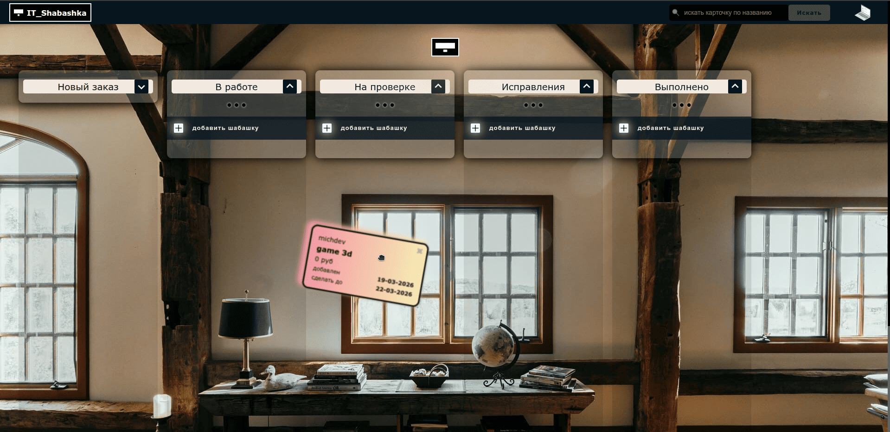

# IT_Shabashka — Кастомная CRM-система для фрилансеров

**IT_Shabashka** — это современная, изолированная CRM-система (Multi-tenant SaaS), разработанная специально для фрилансеров. Проект решает главную проблему независимых специалистов: позволяет в одном красивом и удобном месте вести учет клиентов, контролировать дедлайны шабашек, следить за финансами и настраивать рабочую атмосферу под себя.

Каждый зарегистрированный пользователь получает полностью изолированный личный кабинет. Данные разных пользователей никогда не пересекаются на уровне базы данных.

🔗 **Живой проект:** [https://itshabashka.ru](https://itshabashka.ru)

---

## 🚀 Стек технологий & Архитектура

*   **Frontend**: `Nuxt 3` (Vue.js 3, Composition API) — бэкенд-рендеринг, высокая скорость работы интерфейса и плавная маршрутизация.
*   **Backend-as-a-Service**: `Appwrite` — используется для надежной аутентификации пользователей, хранения данных в NoSQL коллекциях и менеджмента медиафайлов.
*   **Изоляция данных (Безопасность)**: Безопасность реализована на уровне документов Appwrite (Document-level Permissions). 
*   **Хостинг & CI/CD**: `Vercel` + Интеграция с `GitHub`. Настроен автоматический конвейер сборки и непрерывного развертывания проекта (Каждый пуш автоматически обновляет продакшн-версию сайта).

---

## 🔥 Ключевые фичи и функционал

### 1. Кастомизируемая Канбан-доска (Рабочее пространство)
*   **Полноценный Workflow**: Задачи проходят через 5 классических стадий фриланс-разработки: *Новый заказ → В работе → На проверке → Исправления → Выполнено*.
*   **Управление колонками**: Возможность сворачивать ненужные списки для экономии места на экране, менять цвет или градиент фона конкретной колонки, а также сортировать карточки внутри них.
*   **Финансовая аналитика**: Система автоматически считает и выводит общую стоимость всех заказов, находящихся в конкретной колонке.

### 2. Умный трекинг задач и клиентов
*   **Детальные карточки «Шабашек»**: Каждая задача содержит контакты клиента (с кнопками быстрого действия для звонка или отправки email), стоимость проекта, ссылку на макет (Figma/другое) и описание.
*   **Автоматический расчет дедлайнов**: CRM берет дату сдачи проекта и динамически выводит счетчик «Дней до дедлайна». Если времени осталось мало, счетчик подсвечивается предупреждающим цветом.
*   **Кастомизация и логи**: Возможность менять цвет самой карточки для визуального тегирования, а также вести историю внутренних заметок к заказу.
*   **Глобальный поиск**: Моментальный поиск нужного заказа по названию среди всех колонок.

### 3. Модуль «Rooms» (Атмосфера для продуктивности)
*   **Динамическая смена тем**: Фрилансер может в один клик переключить тему оформления всей CRM под свое настроение (*Loft, High tech, Scandinavian, Classic, Japan* и др.), полностью меняя бэкграунд и визуальный стиль.
*   **Встроенное Радио-Плеер**: Интегрированный аудиострим прямо в интерфейсе CRM. Позволяет выбирать радиостанции, запускать/останавливать музыку и регулировать громкость, не отвлекаясь от работы.

### 4. Личный кабинет фрилансера
*   **Статистика профиля**: Наглядные счетчики общего количества шабашек пользователя и его финансового баланса.
*   **Персонализация**: Возможность кастомизировать профиль и загружать собственный аватар.

---

## 📸 Галерея интерфейса (Интерфейс CRM)

<table width="100%">
  <tr>
    <td width="50%">
      
<b>Главный экран: Канбан-доска</b>

      
    </td>
    <td width="50%">
      
<b>Добавление новой шабашки</b>

      
    </td>
  </tr>
  <tr>
    <td width="50%">
      
<b>Детальный просмотр и логи карточки</b>

      
    </td>
    <td width="50%">
      
<b>Выбор рабочих пространств и Радио</b>

      
    </td>
  </tr>
  <tr>
    <td width="50%" colspan="2" align="center">
      
<b>Настройка колонок и профиль пользователя</b>

      
    </td>
  </tr>
</table>

---
